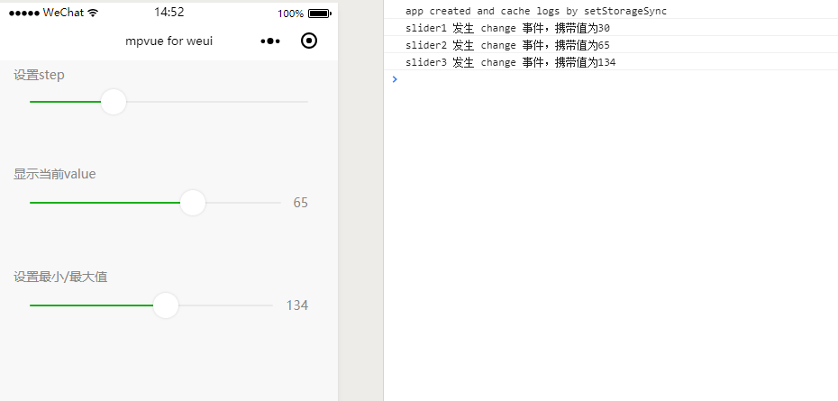

# Slider
滑动选择器。

`mpvue` 对小程序原生组件 `slider` 的各个属性完全支持，还是有两个坑要说下（其实大部分坑都是由于小程序原生组件的绑定事件在 `mpvue` 框架中写法不同造成的）：

!> 1. `slider`的属性`bindchange`和`bindchanging` 在`mpvue`框架中的写法为: `@change`和`@changing`

!> 2. 类型为事件的属性在完成触发事件后，取值的方式为：`event.mp.detail = {value: value}`

``` vue
<template>
  <div class="page">
    <div class="page__bd page__bd_spacing">
      <div class="page__desc">设置step</div>
      <slider @change="sliderChange1" step="5" />
      <div class="page__desc">显示当前value</div>
      <slider show-value value=50 @change="sliderChange2" />
      <div class="page__desc">设置最小/最大值</div>
      <slider show-value @change="sliderChange3" min="50" max="200" />
    </div>
  </div>
  </div>
</template>

<script>
import base64 from '../../../static/images/base64';
export default {
  data() {
    return {
      icon: '',
    }
  },
  mounted() {
    this.icon = base64.icon20;
  },
  methods: {
    sliderChange1(e) {
      console.log('slider1 发生 change 事件，携带值为' + e.mp.detail.value);
    },
    sliderChange2(e) {
      console.log('slider2 发生 change 事件，携带值为' + e.mp.detail.value)
    },
    sliderChange3(e) {
      console.log('slider3 发生 change 事件，携带值为' + e.mp.detail.value)
    }
  }

}
</script>

<style>
slider {
  margin-bottom: 60px;
}
</style>

```

**效果**

